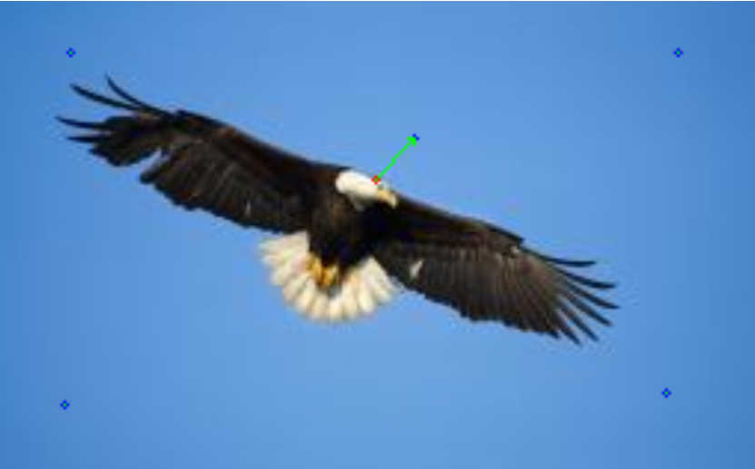
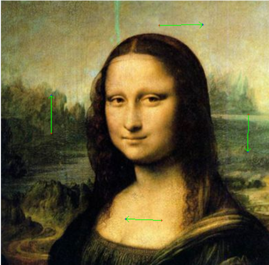
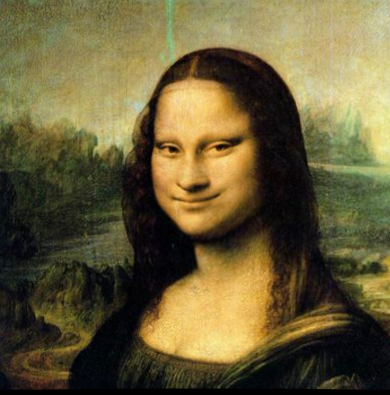

# Report 1 - Image Warping

<center> SA24001010 陈泽高 </center>

## 作业目标
1. 实现图像内容的整体几何变换，如平移、旋转等
2. 实现基于控制点驱动的局部图像变形
## 原理

### 局部图像变形
从几何角度看，图像变形可以不涉及色彩的改变，而是像素的移动（映射）
#### 插值原理
希望对数据做插值 $x^{(i)}\to F_i,\ i=1,2,\dots,N$ 
对于位置 $x$ 上的点，其映射为
$$ S(x) = \sum_{i=1}^{N} a_i g(\left|| x-x^{(i)} \right||) + p_m(x) $$
其中 $g(r)$ 是径向基函数，$a_i$ 是待定系数，$p_m\in \Pi_m$ 是 $m$ 次多项式。

上述有 $N+m+1$ 个未知数， 而插值点方程只有 $N$ 个，因此需要添加额外约束：
$$ \begin{aligned}
S(x^{(i)}) = F_i \quad \quad&,i=1,2,3,\ \dots,N\\
\sum_{i=1}^{N}a_i q(x^{(i)}) = 0\ &,\forall q\in \Pi_m\\
\end{aligned} $$
设 $p_m(x)=\sum_{j=0}^{m}b_j x^j$ ，则待定系数满足：
$$ \begin{aligned}
&\sum_{i=1}^{N} a_i g(\left\| x^{(j)}-x^{(i)} \right\|) 
+ \sum_{k=0}^{m}b_k (x^{(j)})^k = F_i &
,j=1,2,3,\ \dots,N\\
&\sum_{i=0}^{N}a_i (x^{(i)})^k = 0 \quad &
,k=0,1,\dots,m\\
\end{aligned} $$
可以看到，以上是关于 $a_i,b_k$ 的 $(N+m+1)$  阶线性方程组

#### Warping 设计
二维平面上的映射 $T:\mathbb{R}^2\to\mathbb{R}^2$

1. 选取径向基函数，确保对称性

2. 取 $m=1$ ，以体现仿射变换

3. 插值性 $T(x^{(i)},y^{(i)})=(T_U(x^{(i)},y^{(i)}),T_V(x^{(i)},y^{(i)}))=(u^{(i)},v^{(i)}),\ i=1,2,\dots,N$ 

4. 考虑局部性，有时需要放弃插值改为拟合

#### 曲面扭曲程度的度量
除去仿射变换，$f$ 引起的形变可以这样度量：
$$ J(f) = \int\int_{\mathbb{R}^2}[(f_{xx})^2+
2(f_{xy})^2+(f_{yy})^2]\mathrm{d}x \mathrm{d}y $$
对于 image warping，减少形变的总能量表达
$$ \min_{T} J(T_U)+J(T_V) \quad \quad(a)$$
考虑新的能量
$$ \begin{aligned}
\tilde{J}(T_U) = \sum_{i=1}^N\left[u^{(i)}-T_U(x^{(i)},y^{(i)})\right]^2
+ \lambda J(T_U)\\
\tilde{J}(T_V) = \sum_{i=1}^N\left[v^{(i)}-T_V(x^{(i)},y^{(i)})\right]^2
+ \lambda J(T_V)
\end{aligned} $$
$$ \min_{T} \tilde{J}(T_U)+\tilde{J}(T_V) \quad \quad(b)$$
如果对各控制点采用拟合而非插值，能量 $\tilde{J}$ 考虑了拟合误差，随 $\lambda$ 的大小调整拟合策略，是更注重减小拟合误差还是减少图像整体扭曲。

#### 径向基函数及其选取
对于 $g(t)=t^2\log t$ ，其插值得到的解正好是 $(a)$ 最小的
具有局部性质的高斯基函数 $g(r)=\exp(-r^2/ \sigma^2)$ 。
对于本次作业，选取高斯基函数。

### 基础几何变换
对于像素点 $(x,y)$，对齐次坐标 $(x,y,1)$ 通过仿射变换 $T$ 可以实现旋转、平移和放缩。
#### 平移
平移矩阵 
$$ M_T(\Delta x,\Delta y) = \left(\begin{matrix}
1 & 0 & \Delta x \\
0 & 1 & \Delta y \\
0 & 0 & 1
\end{matrix}\right) $$
表示将像素点平移 $(\Delta x,\Delta y)$

#### 旋转
$$ M_R(\theta) = \left(\begin{matrix}
\cos\theta & \sin\theta & 0 \\
-\sin\theta & \cos\theta & 0 \\
0 & 0 & 1
\end{matrix}\right) $$
表示绕原点逆时针旋转 $\theta$
我们希望绕图像中心 $(x_0,y_0)$ 进行旋转，相应的矩阵为
$$ M = M_T(-x_0,-y_0)M_RM_T(x_0,y_0) $$

#### 放缩
$$ M_S(k_x,k_y) = \left(\begin{matrix}
k_x & 0 & 0 \\
0 & k_y & 0 \\
0 & 0 & 1
\end{matrix}\right) $$

## 实现方法
对于基础几何变换，通过交互获得变换矩阵后，调用 opencv 库函数 'cv.WarpAffine()'即可。

对于控制点驱动的图像变形，在求解出映射函数后，还需要处理像素在几何上离散的问题。
一般来说，处理该问题有前向映射和反向映射两种方法：
前向映射指的是将原图像的像素映射到目标位置，然后根据周围的像素填补空缺的像素点；
反向映射即对于每个目标像素点，计算其原像的位置，用双线性插值等方式确定像素值。
对于本方法，反向映射较难，因此采用前向映射的方法。

实践中发现自己实现的映射方法在容易产生错漏和锯齿（即像素值跳跃），因此改用 opencv 的实现 'cv2.remap()'

## 结果展示与讨论
变换效果如图所示：

对于少量控制点的情况，容易观察到变换规律，我们的算法整体上能给出平滑的变换




当控制点的变换含有仿射变换成分，可以通过仿射项解耦出来：




对于人脸等复杂的图像，需要额外固定一些控制点，才能确保变形的局部性




## Requirements

To install requirements:

```setup
python -m pip install -r requirements.txt
```
