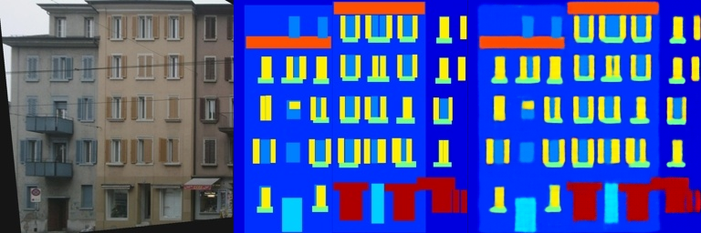
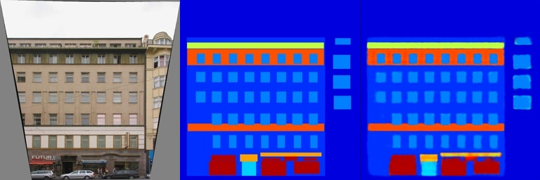

# Pix2pix 图像变换

本次实验的模型基于全卷积网络（[Fully Convolutional Layers](https://arxiv.org/abs/1411.4038)）的跳跃连接思想，通过卷积层和最大池化层提取图像特征，在经过浅层MLP进行分类后，由反卷积的方式恢复特征图尺寸。

## Requirements

To install requirements:

```setup
pip install -r requirements.txt
```

1. 采用 [Facades](https://cmp.felk.cvut.cz/~tylecr1/facade/) 作为数据集
2. 本次作业亦尝试渲染图像 [GTA5](https://download.visinf.tu-darmstadt.de/data/from_games/) 作为数据集，但由于数据量大，图像尺寸大，分类数目且不均衡等原因导致训练时间过长且效果较差，因此放弃使用

## Training

下载 Facades 数据集：
```bash
bash download_facades_dataset.sh
```

准备好数据集后，运行
```
train_facades.py --datasets_folder <dataset-path> --output_folder <your-output-folder>
```

>📋 各参数含义
> 1. `datasets_folder` 数据集文件夹
> 2. `output_folder` 输出文件夹
> 3. `num_epochs` 训练轮次

## Evaluation & Pre-trained Models

对于训练好的模型，打开交互界面（未完成）

```eval
python run_Pix2pix_gradio.py --model-file model/final_model.pth
```

>📋 各参数含义

## Results

训练 200 epoch 后，在验证集上的损失如下：（待完善）

| Model name         | Train Loss  | Val Loss |
| ------------------ |---------------- | -------------- |
| FCN-32s   |     0.028         |      0.0291       |
| FCN-16s   |     0.025          |      0.284       |
| FCN-8s    |     0.023         |      0.28       |

> 对于训练集上的部分特征，拟合的效果较好
<center class='half'>



</center>

> 由于数据集较小，似乎有些特征无法学习到
<center class='half'>


</center>

> 总体来说，添加跳跃连接使得两种误差都有所减小，连接越多，生成的图像（分割）也就越细。从上到下依次为 FCN-8s, FCN-16s, FCN-32s
<center class='half'>


</center>

> 在 FCN-8s 的基础上，尝试了减少 encoder 中的卷积层、增加 decoder 的反卷积层。
增加卷积层数总是有利于损失函数的减小，但结果并不理想，且其训练的成本也应考虑在内。


| Model name         | Train Loss  | Val Loss |
| ------------------ |---------------- | -------------- |
| FCN-8s             |     0.023         |      0.028       |
| 减少卷积层          |     0.03          |      0.296       |
| 增加卷积层          |     0.019         |      0.267     |
| 增加反卷积层        |     0.035         |      0.27       |

<center class='half'>


</center>