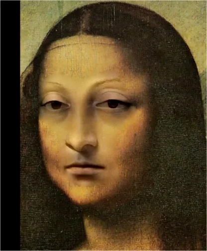
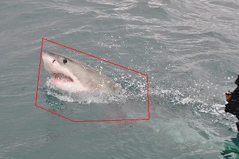
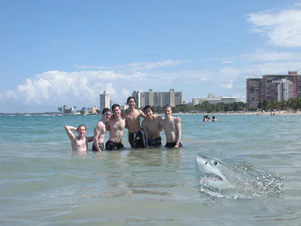

# 原理
> insight：图像内容储存在图像的颜色梯度信息中

在保持梯度不变的情况下，让边界颜色平滑过渡，即可实现图像的无缝融合

$f$ 表示背景，$g$ 表示前景，$f^*$ 表示融合结果，下面 $\mathbf{v}=\nabla g$ 
$$ \begin{aligned}
&f^{*}= \arg \min_{\phi|_{\partial\Omega}=f|_{\partial\Omega}}
\iint_{\Omega}\|\nabla\phi-\mathbf{v}\|^2 \\
&f^{*}|_{\partial \Omega} = f|_{\partial \Omega} \\
& \mathcal{L}(f,g) = \iint_{\Omega}\|\nabla f-\nabla g\| \\
\end{aligned} $$

框架中给出的原理是梯度下降，即通过梯度下降将能量函数 $\mathcal{L}(f,g)$ 最小化

对于图像张量 $I=I[h,w,3]$，对每个（内部）点进行卷积操作：
$$ \Delta I(i,j,c) = \sum_{r,s} I(i-r,j-s,c)\times K(r,s) $$
其中 $K=K[3,3]$，
$$ K = \left( \begin{matrix} 
0 & 1 & 0 \\
1 & -4 & 1 \\
0 & 1 & 0
\end{matrix} \right) $$
就可以得到图像的Laplace信息

# Requirements
导入 `gradio`、`PIL`、`numpy` 和 `torch` 包，运行
```
python run_blending_gradio.py
```

# Results
如图所示，从左到右依次为：前景图像、背景图像、融合结果
<center class='half'>



</center>

<center class='half'>



</center>