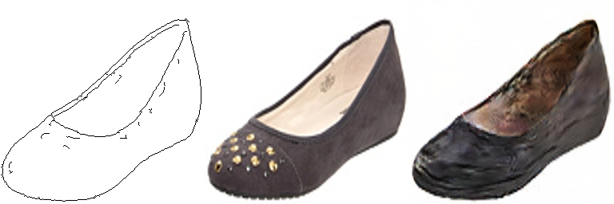

# Increment：GAN

本次实验基于 GAN 的思想，用高质量判别器指导生成器生成正确的图像。

对于[作业二](../02_DIPwithPyTorch/Pix2Pix/Pix2pix_FCN.md)，笔者采用了全卷积网络 FCN-8s 来做像素级分类/生成。该模型可以看作一个生成模型 $G$，
$$ \mathcal{L}(G) = \mathbb E_{x}[f(G(x)-y)] $$
其中 $x$ 是输入数据，$y$ 是对应输出，$f$ 是损失函数

接下来，将判别器从简单的误差替换为CNN网络，
用判别器的误差来指导生成器学习：
$$ \begin{aligned} \mathcal{L}_{GAN}(G,D) 
=& \lambda\mathbb E_{x,y}[\log D(x,y)] \\
& +\mathbb E_{x,z}[\log (1-D(x,G(x)))]
\end{aligned} $$

判别器 $D$ 将对图像的高维特征图的每个像素做判别，而不是对整张图像来判别，
这样实际上相当于将图像划分为若干区域。
## Requirements

To install requirements:

```setup
pip install -r requirements.txt
```

1. 采用 [edge2shoes](https://huggingface.co/datasets/huggan/edges2shoes) 作为数据集
2. 采用 [Facades](https://cmp.felk.cvut.cz/~tylecr1/facade/) 作为数据集

## Training

准备好数据集后，运行
```
python train_GAN.py --datasets_folder <folder> --output_folder /output --type edge2shoes --nData 3000 --batch_size 30 --num_epochs 100 --L1_lambda 100
```

>📋 各参数含义
> 1. `datasets_folder` 数据集文件夹
> 2. `output_folder` 输出文件夹
> 3. `num_epochs` 训练轮次
> 4. `nData` 为了减少训练时间，仅截取部分数据
> 5. `type` 对于facades数据集和edge2shoes采用了不同的数据处理方式

## Evaluation & Pre-trained Models

对于训练好的模型，打开交互界面（未完成）

```eval
python run_GAN_gradio.py --model-file model/final_model.pth
```

>📋 各参数含义

## Results

取 $\lambda=100$，训练 100 epoch 后，在edge2shoes验证集上的判别器准确率如下：

| Model name         | $D$ accuracy  |
| ------------------ |---------------- |
| my GAN   |     0.58         |
| ref GAN   |     0.75          |
| -------------- | ---------------- |
| my GAN(facades) | 0.63 |

### 与原始生成网络对比
> 在[Facades](https://cmp.felk.cvut.cz/~tylecr1/facade/)数据集上，直接用原网络和L1误差进行训练，部分结果如下
<center class='half'>


</center>

> 在引入判别器后，有效减少了模糊的部分：
<center class='half'>


</center>
不过由于数据量较小，过拟合的效果比较严重。可以看到判别器GAN的瑕疵具有比较明显的特征，而这些特征正是判别器不能分辨的

### 与其他模型对比
> 为了对照，笔者在网上找到了一个[参考模型](ref/network.py)。该模型具有更多池化层，因此训练效率较高。
不难看出，尽管整体上能完成对shoes的生成，但也有丢失细节、颜色较脏等缺陷。
<center class='half'>



</center>

> 在edge2shoes数据集上，用作业二中的[FCN-8s网络](../02_DIPwithPyTorch/Pix2Pix/network.py)作为生成器$G$，训练得到的部分结果如下：
<center class='half'>


</center>
