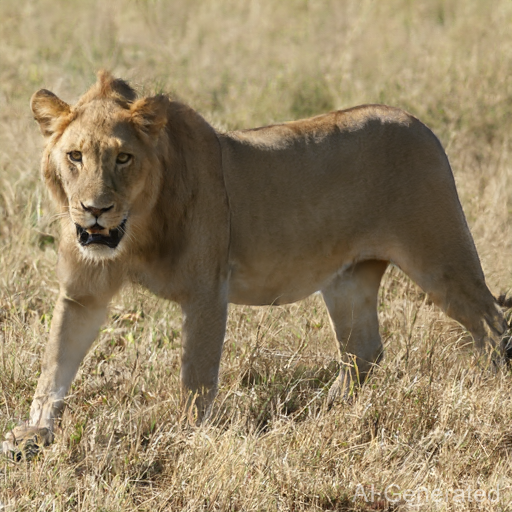
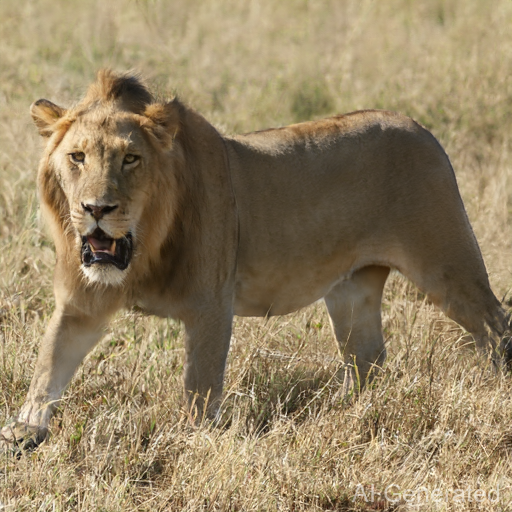
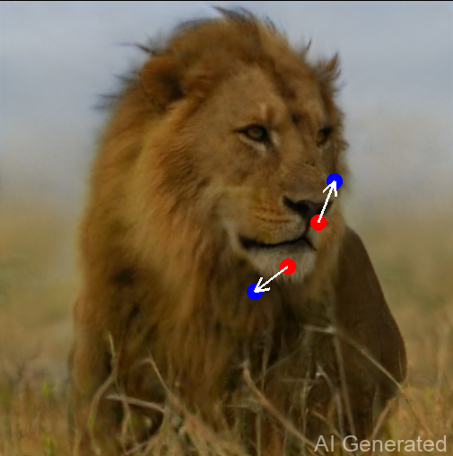
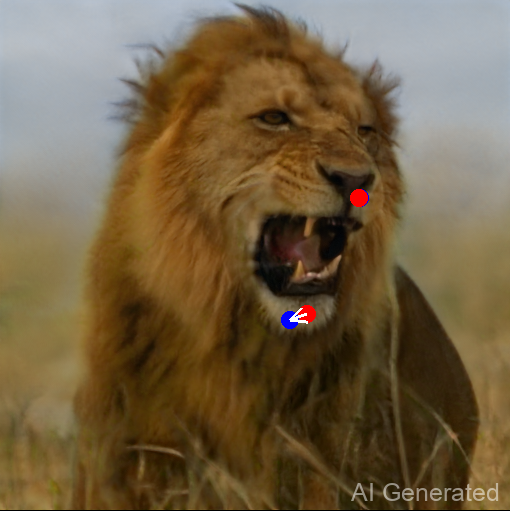
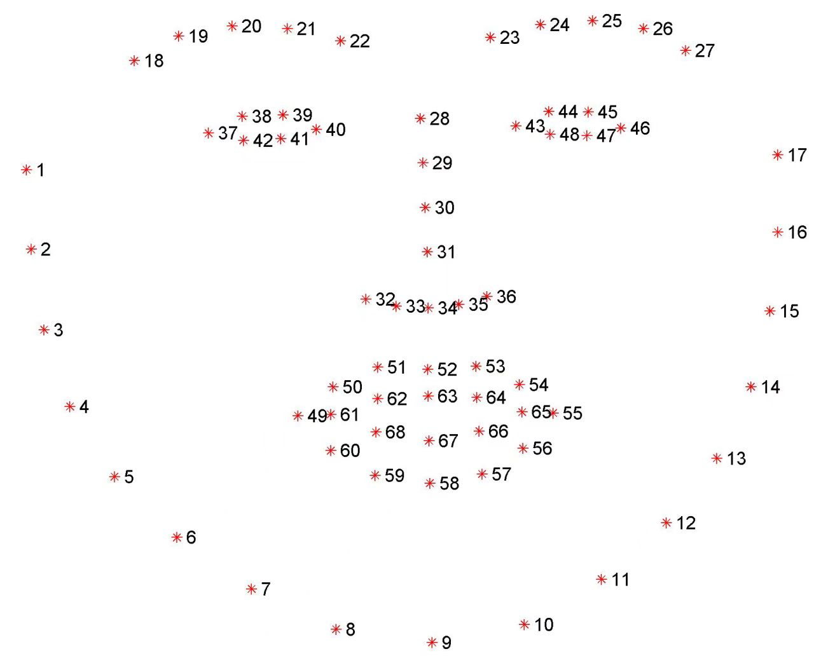
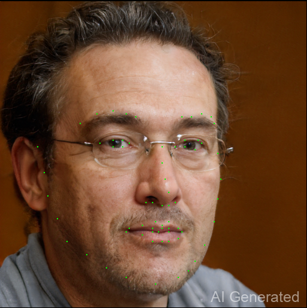
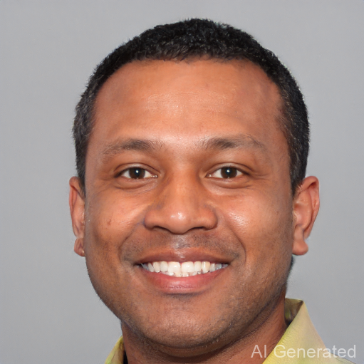
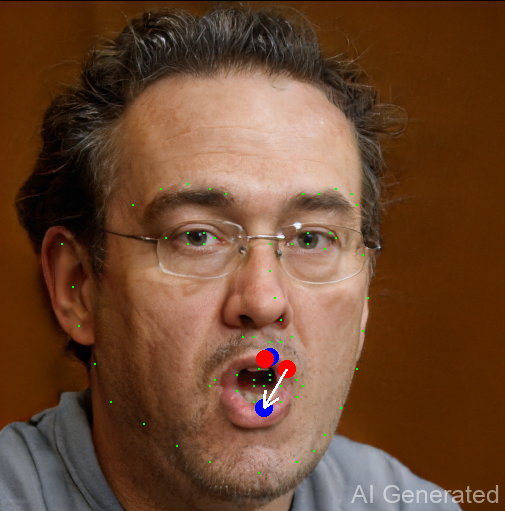

# Combination：DragGAN + face-alignment

## 相关工作
### DragGAN
- [Pan 等人](https://vcai.mpi-inf.mpg.de/projects/DragGAN/) 提出了一种基于“拖动”的用户交互方式，允许用户通过拖动图像中的点来精确控制生成内容。该实现包含两个关键技术：

> 1. 基于特征的运动监督：驱动点向目标位置移动。
> 2. 点跟踪方法：利用 GAN 特征持续定位点的位置。

- 以下是笔者用DragGAN（cpu）跑出的两个实例
<center class='half'>


</center>

<center class='half'>


</center>

### face-alignment
- [FAN](https://www.adrianbulat.com) 等人实现了人脸特征识别，输出为（2D、3D）特征点列，勾勒出人脸下颌、眼睛、鼻梁、嘴唇等关键部分，如图所示

<center class='half'>


</center>

## 基于人脸特征点识别和 DragGAN 的自动编辑
将二者相结合，可以较容易地实现人脸拖拽编辑的自动化。例如，取特征点移动

$$ \begin{aligned} s_{63} \to (s_{63}+s_{67})/2 \\
s_{67} \to (s_{63}+s_{67})/2 \end{aligned} $$

输入 `DragGAN`，则实现“闭嘴”的功能：
<center class='half'>


</center>

同理，可以实现“张嘴”、“睁大眼睛”等编辑的自动化：
<center class='half'>


</center>
可以看到，DragGAN在这里有一些跟踪失误，但不影响自动编辑。

## Requirement
- 由于个人配置原因，笔者采用了cpu版本来运行 `DragGAN`，且修改了部分源代码。如果要复现，则需将标有 `#czg` 的代码删去
- 按说明配置好 [`DragGAN`](DragGAN/README.md) 以及 [face-alignment](face-alignment/README.md) 

To start the DragGAN GUI, simply run:
```sh
sh scripts/gui.sh
```
If you are using windows, you can run:
```
.\scripts\gui.bat
```

> 1. 界面上有几个按钮 `close mouse` / `open mouse` / `open eyes`，点击即可自动实现相关编辑
> 2. 点击 `Gen points` 按钮，将在图中展现人脸识别的特征点
> 3. 修改参数 `feature step`，它控制前述人脸编辑的幅度

