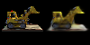
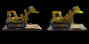
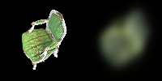
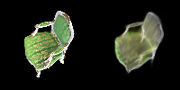
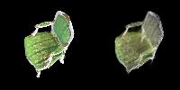

# 3DGS

本次实验采用带有颜色的 3D 高斯球代替三维重建中的点云模型，将每个点表示为一个小的高斯分布（Splat），在渲染时生成平滑且连续的表面，提升视觉效果。

## Requirements

To install requirements:

```setup
pip install -r requirements.txt
```

1. 采用 [Chair](data/chair/images/) 和 [lego](data/lego/images/) 稀疏照片集
2. 用 colmap 来分析相机位姿，结果存储在 [Chair](data/chair/sparse/0_text) 和 [lego](data/lego/sparse/0_text)

## Training

``` train
python train.py --colmap_dir /data/chair --outputs <output-folder> --num_epochs 100 --batch_size 1 --debug_every 10 --debug_samples 1
```

>📋 各参数含义
> 1. `colmap_dir` 数据集
> 2. `outputs` 输出文件夹
> 3. `num_epochs` 训练轮次

## Evaluation & Pre-trained Models

[gaussian_model](gaussian_model.py)和[gaussian_renderer](gaussian_renderer.py)的代码已补全。
但在训练时出现 loss=nan 的情况，正在排查中

> 2025-01-13: 修改代码，完成

## Results

- 训练结果如下：分别为 `epoch` 为 $0,20,50,100$ 时的图像
<center class='half'>




</center>

<center class='half'>




</center>